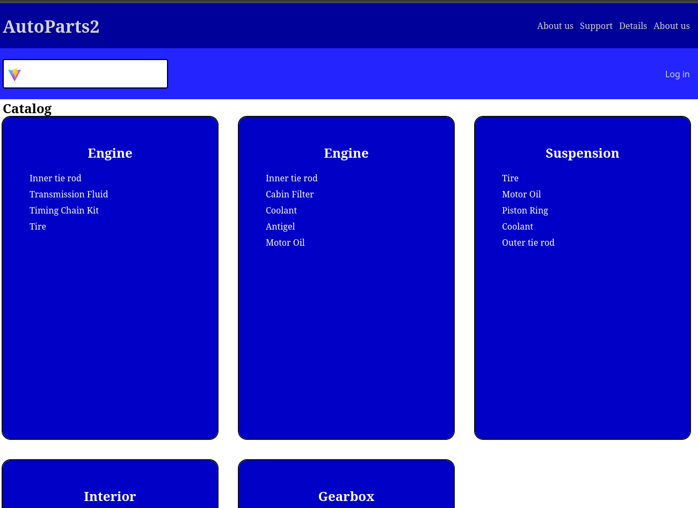
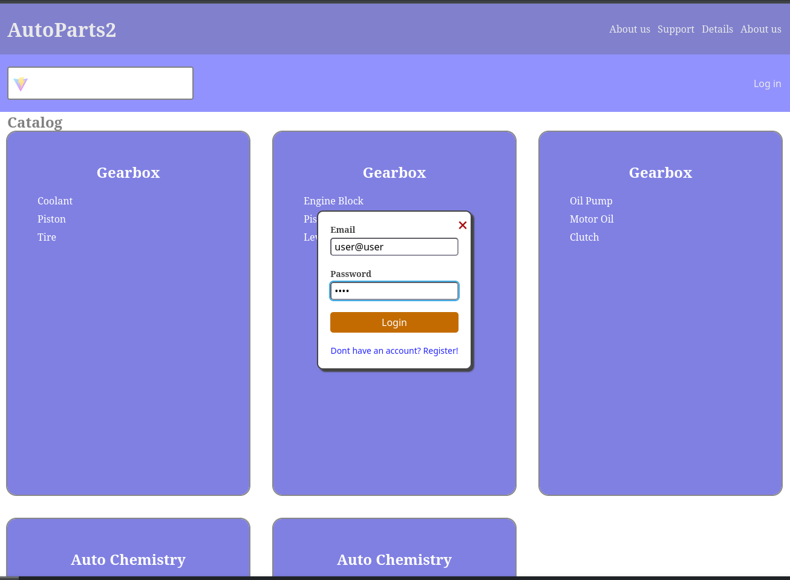
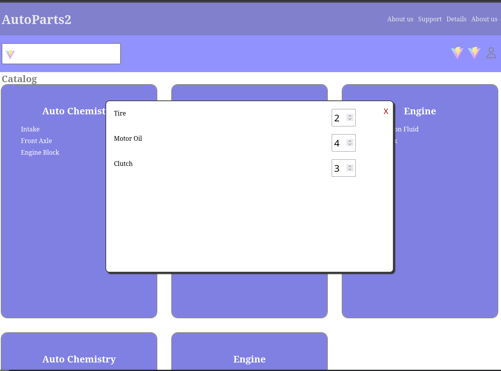

# About
This project is rewrite of my university project. 
The original project was kind a mess. 
It was fullstack and written using pure PHP, HTML, CSS, JS. 
The idea of this repo is to separate frontend from backend, add more interactivity.
# Stack
## Frontend
- HTML, CSS, JS
- React (Router, Hook-Form)
## Backend
- Apache
- PHP

# Authors
- Me (RealDontMatter, ipz231_pmo)

# Screenshots

# Refs
[Frontend Repository](https://github.com/RealDontMatter/autoparts2-frontend)

[Backend Repository](https://github.com/RealDontMatter/autoparts2-backend)

# TODO
## Pages
- Add order confirmation page
- Add product page
- Add favorite page
## Components
- Update cart modal
- Add navbar for navigation though categories